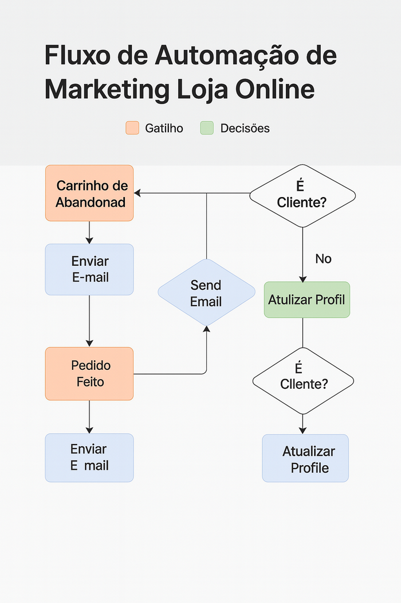
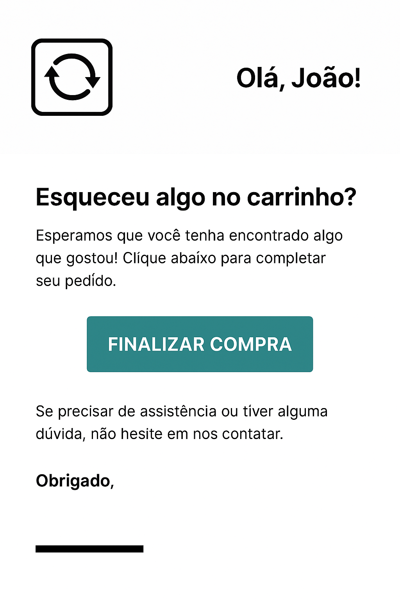

# 🛒 Automação de Marketing e Vendas para E-commerce: Recuperação de Carrinhos e Pós-Compra 🚀


-blue)


## 📝 Visão Geral do Projeto

Este projeto de portfólio demonstra a implementação de um sistema robusto de automação de marketing e vendas focado em e-commerce. O objetivo principal é otimizar o funil de vendas, recuperando carrinhos abandonados e fomentando a recompra, resultando em aumento de receita e fidelização de clientes para uma loja online fictícia de produtos artesanais.

---

## 🔍 Problema Endereçado

Lojas online frequentemente enfrentam desafios como:

* Altas taxas de abandono de carrinho, resultando em perdas significativas de vendas.
* Baixa taxa de recompra, indicando a necessidade de um relacionamento pós-venda mais eficaz.

Esta automação foi projetada para mitigar esses problemas, transformando visitantes interessados em clientes fiéis e maximizando o retorno sobre o investimento em aquisição.

---

## 🎯 Objetivos da Automação

Os principais objetivos deste projeto são:

* Aumentar a **taxa de recuperação de carrinho abandonado em 15%**.
* Aumentar a **taxa de recompra** de clientes em **10%**.
* Melhorar a **experiência do cliente** no pós-compra e incentivar feedback.

---

## 🎯 Público-Alvo

Este projeto foi desenvolvido com foco nos seguintes perfis:

- **Recrutadores e profissionais de tecnologia** que desejam avaliar habilidades em automação, Python e marketing digital.
- **Donos de e-commerce ou gestores de marketing** que buscam entender como implementar automações de recuperação de carrinho e pós-venda.
- **Desenvolvedores iniciantes ou intermediários** que queiram aprender como integrar ferramentas como Klaviyo, Make, WhatsApp API e Google Sheets com Python.

---

## ✨ Funcionalidades Principais

O sistema de automação implementa os seguintes fluxos e capacidades:

1. **Sequência de E-mails de Recuperação de Carrinho:** Série de e-mails automatizados e personalizados para incentivar a finalização da compra, incluindo lembretes, urgência e ofertas de desconto.
2. **Fluxo de Boas-Vindas e Pós-Compra:** E-mails de confirmação de pedido, solicitação de avaliação/feedback e recomendações de produtos personalizadas para incentivar a recompra.
3. **Qualificação de Leads (Lead Scoring - via Python/Módulo `lead_scoring.py`):** Atribuição de pontuação a leads com base em seu comportamento (visitas a páginas de produto, cliques em e-mails, etc.), ajudando a identificar os clientes mais engajados e com maior probabilidade de conversão.
4. **Notificações Automatizadas (WhatsApp - via Python/Módulo `whatsapp_bot.py`):** Capacidade (simulada) de enviar mensagens automatizadas via WhatsApp para lembretes de carrinho ou confirmações importantes, utilizando bibliotecas Python para interação com APIs de mensageria.
5. **Geração de Relatórios Simplificados:** Coleta, processamento e apresentação de dados de performance dos fluxos, usando scripts Python para manipular e analisar informações de vendas e engajamento.

---

## 🛠️ Tecnologias e Ferramentas Utilizadas

Este projeto faz uso e demonstra proficiência nas seguintes tecnologias e plataformas:

* **Plataforma de E-commerce (Conceitual/Simulada):** Shopify
    * Utilizada como base para os eventos de "carrinho abandonado" e "compra finalizada".
* **Plataforma de Automação de Marketing / Email Marketing:** Klaviyo
    * Escolha ideal para e-commerce devido às suas capacidades avançadas de segmentação, personalização e fluxos.
* **Linguagem de Programação:** Python
    * Para scripts personalizados de integração de dados, automação de tarefas específicas (como Lead Scoring), e simulação de notificações.
        * Bibliotecas comuns: `pandas` (para manipulação de dados), `requests` (para interações com APIs), `openpyxl` (para ler/escrever em Excel).
* **Ferramentas de Integração (Conceitual):** Zapier / Make (anteriormente Integromat)
    * Consideradas para cenários mais complexos de conexão entre serviços que não possuem integração nativa direta com o Klaviyo.
* **Gerenciamento de Dados:** Google Sheets / Arquivos CSV/XLSX
    * Utilizados para simular dados de entrada (listas de clientes, carrinhos abandonados) e para armazenar resultados intermediários ou relatórios gerados pelos scripts Python.
* **Controle de Versão:** Git & GitHub

---

## 🚀 Demonstração

Esta seção conterá recursos visuais para ilustrar o projeto em ação.

* 🛒 **GIF Animado do Fluxo de Carrinho Abandonado:**  
  

* 📊 **Screenshot do Workflow no Klaviyo:**  
  

* ✉️ **Exemplo de E-mail de Recuperação de Carrinho:**  
  

* 📈 **Exemplo de Relatório de Performance (gerado por Python):**  
  

---

## ⚙️ Como o Projeto Funciona (para Desenvolvedores/Analisadores)

Para entender a lógica de automação e a estrutura de código, siga estes passos:

1. **Clone o Repositório:**
    ```bash
    git clone https://github.com/NeusaM21/ecommerce-marketing-automation.git
    cd ecommerce-marketing-automation
    ```

2. **Estrutura de Pastas:**
    * `modules/`: Contém os scripts Python e módulos auxiliares, como envio de e-mails, lead scoring, bot do WhatsApp e configuração.
    * `data_samples/`: Contém os dados simulados, como planilhas de carrinhos abandonados e lista de clientes.
    * `assets/`: Armazena todas as imagens, diagramas, GIFs e screenshots de apoio.
    * `docs/code/`: Contém a documentação detalhada do projeto, incluindo análise, fluxos e resultados.

3. **Configuração do Ambiente Python (se você for rodar os scripts):**
    * Certifique-se de ter Python instalado.
    * Instale as dependências listadas no `requirements.txt`:
        ```bash
        pip install -r requirements.txt
        ```
    * Crie seu arquivo de configuração para as APIs (NÃO INCLUA CREDENCIAIS REAIS NESTE REPOSITÓRIO PÚBLICO!):
        * Copie o template: `cp config_template.py config.py`
        * Edite `config.py` e preencha com credenciais fictícias ou de teste para as APIs que você usaria (Klaviyo, WhatsApp, etc.).

4. **Execução dos Scripts (Exemplo):**
    * O arquivo `main.py` orquestra as automações. Você pode executá-lo para simular o processo:
        ```bash
        python main.py
        ```
    * Explore os módulos em `modules/` para entender as funcionalidades específicas de envio de e-mail, lead scoring e o bot de WhatsApp.

---

## 📚 Documentação Detalhada

Para uma compreensão aprofundada da análise estratégica, dos fluxos de automação e dos detalhes da implementação, explore os arquivos na pasta `docs/code/`:

* [01 - Análise e Planejamento**](docs/01_Analise_Publico_Alvo.md)
    * Problema, Objetivos, Persona e Mapeamento da Jornada do Cliente.
* [**02 - Fluxos de Automação**](docs/code/02_Fluxos_Ecommerce.md)
    * Diagramas e descrições detalhadas dos fluxos de recuperação de carrinho e pós-compra.
* [03 - Tecnologias e Implementação](docs/03_Tecnologias_usadas.md)
    * Como as automações seriam configuradas nas plataformas Shopify, Klaviyo e via scripts Python.
* [**04 - Insights e Resultados Simulados**](docs/code/04_Insights_Resultados.md)
    * Análise dos resultados esperados e o impacto gerado pela automação.

---

## 👤 Autor

**NeusaM21**  
Desenvolvedora de Automação & Analista de Marketing Digital

- 📧 [Email](mailto:contact.neusam21@gmail.com)

---

## 📄 Licença

Este projeto está licenciado sob a Licença MIT - veja o arquivo [LICENSE](LICENSE) para detalhes.
