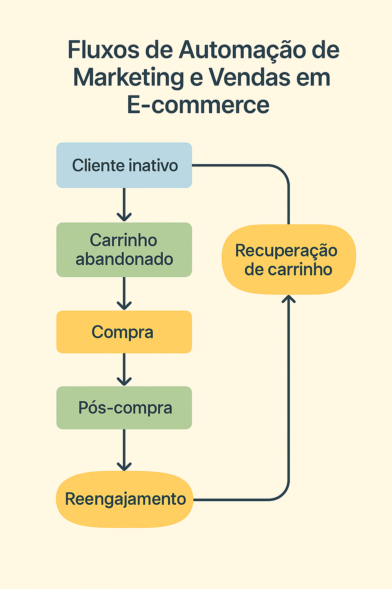

# 02 - Fluxos de Automação para E-commerce

Este módulo documenta os principais fluxos de automação criados para resolver os problemas identificados na análise anterior. O foco está em recuperar carrinhos abandonados, engajar o cliente no pós-venda e estimular a recompra com o mínimo de esforço manual.

---

## 🔁 Fluxo 1: Recuperação de Carrinho Abandonado

Este fluxo é ativado automaticamente quando um cliente adiciona produtos ao carrinho, mas não conclui a compra em até X horas.

### 🧩 Lógica:

1. **Gatilho:** Cliente abandona o carrinho (detectado via Shopify/Klaviyo).
2. **Delay:** Aguarda 2h para evitar abordagens precipitadas.
3. **Email 1 – Lembrete suave:** “Você esqueceu algo no carrinho?”
4. **Email 2 – Urgência + Prova social:** “Estoque limitado!” + avaliações de outros clientes.
5. **Email 3 – Oferta de incentivo (opcional):** cupom de 10% para fechar a compra.
6. **Encerramento:** Se a compra não for concluída após 3 e-mails, o fluxo é encerrado.

### 📬 Canal principal: E-mail marketing via Klaviyo  
### 🛒 Gatilho técnico: Evento "Checkout Started" sem "Order Placed"

### 📸 Ilustração do fluxo:

  

---

## ✉️ Fluxo 2: Pós-Compra e Boas-Vindas

Este fluxo começa imediatamente após a confirmação de compra e tem como objetivo melhorar a experiência do cliente e estimular a recompra.

### 🔗 Lógica:

1. **Gatilho:** Pedido confirmado
2. **Email 1 – Confirmação de compra personalizada**
3. **Email 2 – Agradecimento + dicas de uso do produto**
4. **Email 3 – Solicitação de feedback/avaliação**
5. **Email 4 – Recomendação de produtos complementares**
6. **Opção final:** Adicionar a lead em outro fluxo de recompra futura

### 📬 Canal principal: E-mail marketing  
### 🎯 Estratégia: Engajamento + Humanização da marca

---

## 🤖 Fluxo 3: Notificações Automatizadas via WhatsApp (Simulado)

Este fluxo simula o uso de mensagens rápidas para reforçar pontos de contato, especialmente para carrinho abandonado ou confirmação de entrega.

### 💬 Exemplo de Mensagens:

- “Ei, Clara! Seu carrinho ainda está te esperando 💛”
- “Seu pedido chegou? Conta pra gente o que achou! 😊”

### 🛠️ Tecnologias simuladas:

- Python (`whatsapp_bot.py`)
- Integração com API de mensageria (ex: Twilio, Z-API)

---

## 🧠 Fluxo 4: Reengajamento de Leads Inativos

Este fluxo visa trazer de volta usuários que interagiram com a loja, mas não compraram ou abriram e-mails por X dias.

### 📊 Estratégia:

1. Segmentação de leads frios
2. Envio de campanhas personalizadas com novos produtos ou ofertas exclusivas
3. Análise de reabertura e engajamento

---

## 📦 Organização dos Fluxos no Projeto

| Nome do Fluxo               | Arquivo/Script                   | Simulação | Plataforma |
|----------------------------|----------------------------------|-----------|------------|
| Carrinho Abandonado        | klaviyo_workflow.png / docs      | ✅        | Klaviyo    |
| Pós-compra                 | email_recuperacao.png / docs     | ✅        | Klaviyo    |
| WhatsApp Bot (simulado)    | modules/whatsapp_bot.py          | ✅        | Python     |
| Reengajamento de Leads     | modules/lead_scoring.py          | ✅        | Python + Sheets |

---

## ✅ Conclusão

Esses fluxos compõem uma estrutura de automação completa, cobrindo desde a **recuperação de vendas perdidas** até a **fidelização de clientes ativos**. Todos os processos são documentados e podem ser adaptados a ferramentas reais, como Klaviyo, Make e WhatsApp API, com mínimo esforço técnico adicional.
