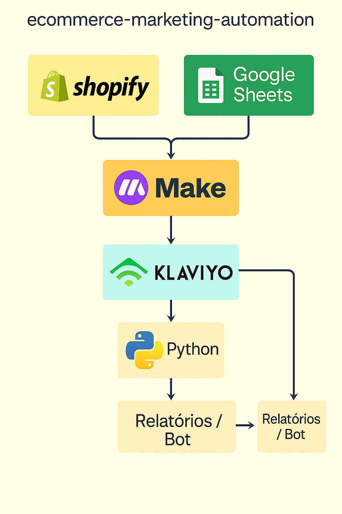

# 03 - Tecnologias e Ferramentas Utilizadas

Este documento apresenta as principais tecnologias utilizadas na construção e simulação dos fluxos de automação do projeto. A proposta é demonstrar como ferramentas técnicas (reais e simuladas) podem ser integradas para otimizar conversão e fidelização em um e-commerce.

---

## 🐍 Linguagem de Programação: Python

Utilizado para criação de scripts personalizados de automação, geração de relatórios, bots de WhatsApp e integração com APIs.

### 📚 Principais bibliotecas:

- `pandas` → Manipulação de dados (clientes, carrinhos, interações)  
- `openpyxl` → Leitura e escrita de planilhas (XLSX, CSV)  
- `requests` → Integração com APIs externas (WhatsApp, Klaviyo, Google Sheets)  
- `matplotlib` → Criação de gráficos e visualizações  
- `datetime` → Controle de datas e tempos em fluxos automatizados  

---

## 🧩 Plataformas e Ferramentas de Automação

### ✉️ Klaviyo (conceitual/simulado)

Plataforma de automação de marketing voltada para e-commerce.

Utilizado para simular:

- Fluxo de **recuperação de carrinho**
- Fluxo de **pós-compra e fidelização**
- Envio de e-mails segmentados com base em eventos
- Métricas de abertura, cliques e conversão

📸 Exemplo de fluxo no Klaviyo:

---

### 🛍️ Shopify (simulada)

Plataforma de e-commerce usada apenas como referência para simular:

- Gatilhos como abandono de carrinho ou finalização de compra  
- Consulta ao histórico de pedidos  
- Perfis de clientes

---

## 🤖 Bots Automatizados via Python

Scripts criados para simular interações automáticas com clientes via WhatsApp API:

### `whatsapp_bot.py`

- Envia lembretes de carrinho abandonado  
- Confirma pedidos realizados  
- Integração simulada com APIs como Z-API ou Twilio

---

## 📊 Google Sheets como base de CRM

Google Sheets foi usado como banco de dados leve e acessível para simular:

- Listas segmentadas de clientes (ativos, inativos, engajados)  
- Base de leads e carrinhos abandonados  
- Geração de relatórios e acompanhamento via Excel

---

## 🔄 Integrações No-Code (conceituais)

### 🔧 Make (ex-Integromat)

Simulação de automações entre sistemas como:

- Shopify + Klaviyo  
- Klaviyo + WhatsApp  
- Google Sheets + Python  

Exemplos:

- Novo pedido → envia confirmação automática  
- Carrinho abandonado → cria evento de follow-up  
- Cliente inativo → envia campanha de reativação

---

## 🛠️ Outras Ferramentas Utilizadas

| Ferramenta       | Finalidade                                                      |
|------------------|------------------------------------------------------------------|
| **VS Code**      | Ambiente principal de desenvolvimento                          |
| **Git + GitHub** | Controle de versão e publicação do projeto no portfólio        |
| **Draw.io**      | Criação de fluxogramas e esquemas visuais                      |
| **Markdown**     | Documentação técnica organizada no formato `.md`               |
| **ChatGPT**      | Apoio na estruturação do conteúdo e geração de simulações      |

---

## 🖼️ Diagrama das Tecnologias Utilizadas

  

---

## ✅ Conclusão

A união entre código, automação no-code e ferramentas de marketing digital permitiu a construção de um projeto realista, funcional e pronto para expansão. Todos os fluxos são aplicáveis em ambientes reais com pequenos ajustes, tornando este um projeto sólido para portfólio ou produção.